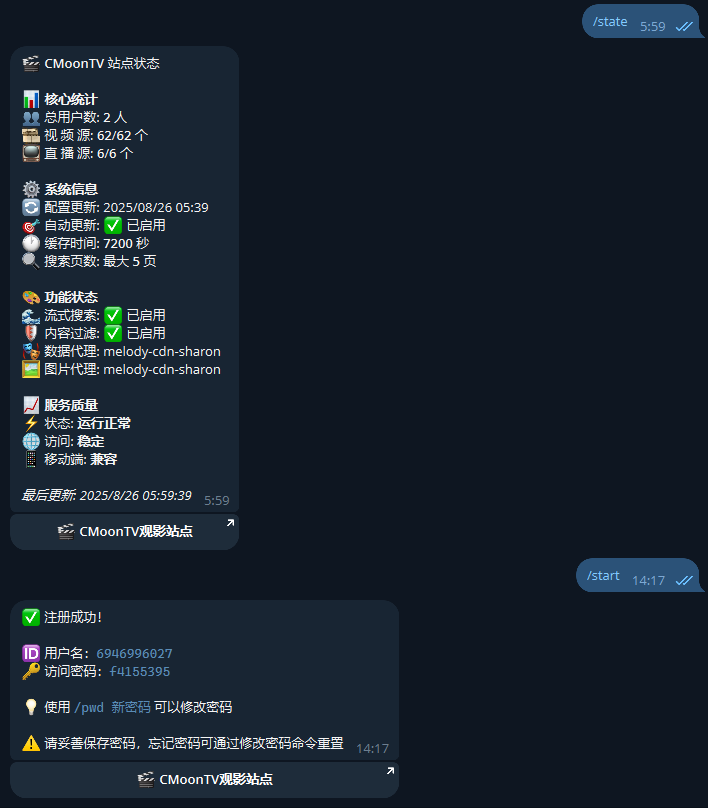

# MoonTV Register Bot


🤖 基于 Cloudflare Workers 的 MoonTV 用户注册 Telegram 机器人

## 📋 项目简介

这是一个运行在 Cloudflare Workers 平台上的 Telegram 机器人，用于 MoonTV 平台的用户注册管理。机器人通过 MoonTV API 接口进行用户管理，支持用户自动注册、密码修改等功能，使用 Cloudflare KV 进行数据缓存。

## ✨ 功能特性

- 🔐 **用户注册**：群组成员可以通过机器人快速注册 MoonTV 账户
- 🔑 **密码管理**：支持用户自定义修改访问密码
- 👥 **溯源可查**：用户名为 Telegram 数字 ID
- 🌐 **API 集成**：直接调用 MoonTV API 进行用户管理
- ⚡ **无服务器部署**：基于 Cloudflare Workers 平台，无需管理服务器
- 🛡️ **安全配置**：支持环境变量配置，保护敏感信息
- 💾 **智能缓存**：使用 KV 存储 Cookie 缓存，提高响应速度

## 🛠️ 技术栈

- **平台**：Cloudflare Workers
- **语言**：JavaScript (ES6+)
- **存储**：Cloudflare KV (Cookie缓存)
- **API**：Telegram Bot API + MoonTV API
- **部署工具**：Wrangler CLI

## 🚀 快速开始
### 1. 部署方式
- **Workers** 部署：复制 [_worker.js](https://github.com/cmliu/CF-Workers-MoonTVRegisterBot/blob/main/_worker.js) 代码，`保存并部署`即可
- **Pages** 部署：`Fork` 后 `连接GitHub` 一键部署即可

### 2. 绑定KV空间
   - 绑定**变量名称**为`KV`的**KV命名空间**；

### 3. 配置环境变量

在 Cloudflare Workers 控制台中配置以下环境变量：

| 变量名 | 描述 | 必需 | 示例值 |
|--------|------|------|--------|
| `BOT_TOKEN` | Telegram Bot Token | ✅ | `123456:ABC-DEF1234ghIkl-zyx57W2v1u123ew11` |
| `GROUP_ID` | Telegram 群组 ID，用于鉴权，仅允许群组成员注册 | ✅ | `-1001234567890` |
| `MOONTVURL` | MoonTV 前端地址，用于用户直接访问 | ✅ | `https://moontv.dedyn.io` |
| `APIURL` | MoonTV 源地址，用于API调用，为空则调用`MOONTVURL` | ❌ | `https://tcp.sg-members-1.clawcloudrun.com` |
| `USERNAME` | MoonTV 管理员用户名 | ✅ | `admin` |
| `PASSWORD` | MoonTV 管理员密码 | ✅ | `admin_password` |
| `TOKEN` | Webhook 初始化令牌 | ✅ | `your-token` |

> [!WARNING]
> `USERNAME`与`PASSWORD`为**管理员**权限即可，无需站长权限，风险可控。

### 4. 初始化机器人

⚠️ **重要步骤**：部署完成后，访问以下 URL 来初始化机器人的 Webhook：

```url
https://your-worker-name.your-subdomain.workers.dev/your-token
```

访问成功后，你将看到初始化成功的 JSON 响应。

> [!TIP]
> 请把机器人加入到你配置的 `GROUP_ID` 群组；
>
> 若 **群组成员列表可见** ，机器人 **无需特殊权限** ；
> 
> 若 **成员列表被隐藏** ，请授予机器人群 **管理员权限** 。

## 🤖 机器人命令

| 命令 | 功能 | 用法示例 |
|------|------|----------|
| `/state` | 查看站点状态信息 | `/start` |
| `/start` | 注册/查看用户信息 | `/start` |
| `/pwd` | 修改访问密码 | `/pwd 新密码` |

## 📱 使用流程

1. **加入群组**：用户必须先加入指定的 Telegram 群组
2. **开始注册**：向机器人发送 `/start` 命令
3. **自动创建账户**：系统通过 MoonTV API 创建用户账户
4. **修改密码**（可选）：使用 `/pwd 新密码` 命令修改密码

## 🔧 监控与检测

访问以下 URL 可以检测服务状态：

```url
https://your-worker-name.your-subdomain.workers.dev/check?token=your-token
```

检测内容包括：
- MoonTV API 连接状态
- Cookie 获取和缓存状态  
- 配置 API 访问权限
- 用户数量统计

## 🏗️ 项目结构

```
CF-Workers-MoonTVRegisterBot/
├── _worker.js          # 主要的 Worker 代码
├── package.json        # 项目配置文件
├── wrangler.toml      # Cloudflare Workers 配置
├── README.md          # 项目文档
└── .gitignore         # Git 忽略文件
```

## ⚠️ 注意事项

1. **安全性**：请确保 MoonTV 管理员密码安全
2. **权限控制**：机器人只允许指定群组的成员使用
3. **密码强度**：密码长度至少为 6 位字符
4. **Cookie 缓存**：系统自动管理 Cookie 缓存，有效期 5 天

## 📄 许可证

本项目采用 MIT 许可证 - 查看 [LICENSE](LICENSE) 文件了解详情

## 🙏 致谢

- [LunaTV(MoonTV)](https://github.com/MoonTechLab/LunaTV)
- [ktff](https://t.me/zero_freez)
- [Selene APP客户端](https://github.com/MoonTechLab/Selene)